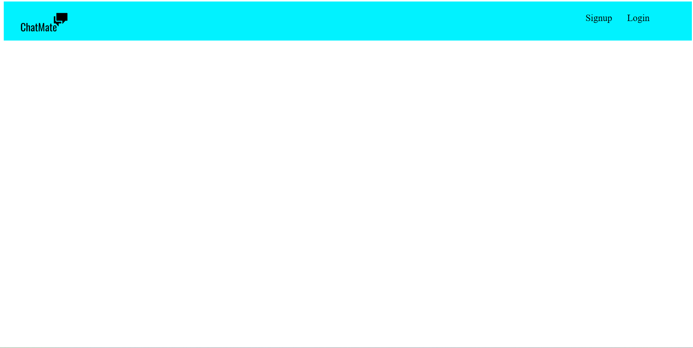
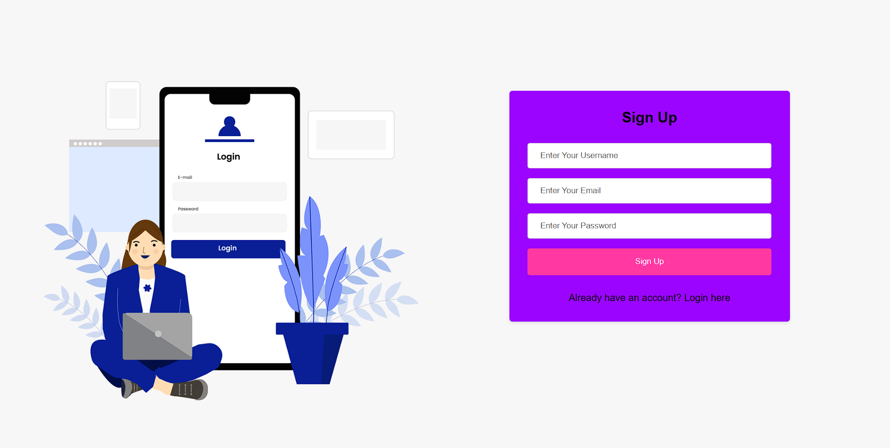
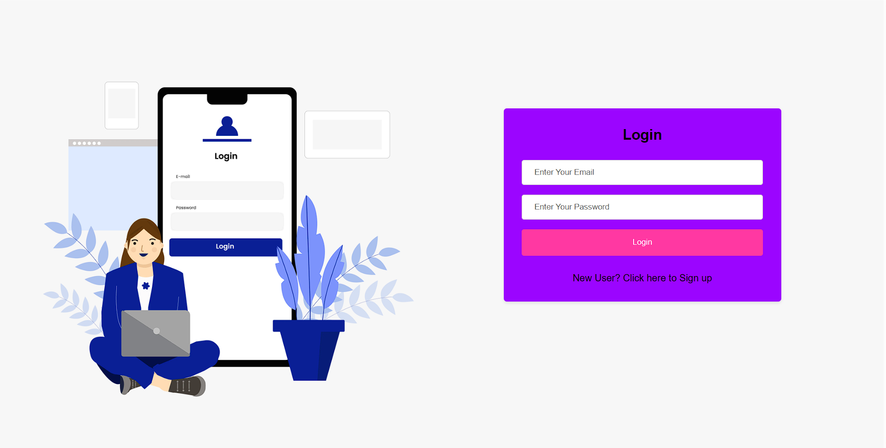
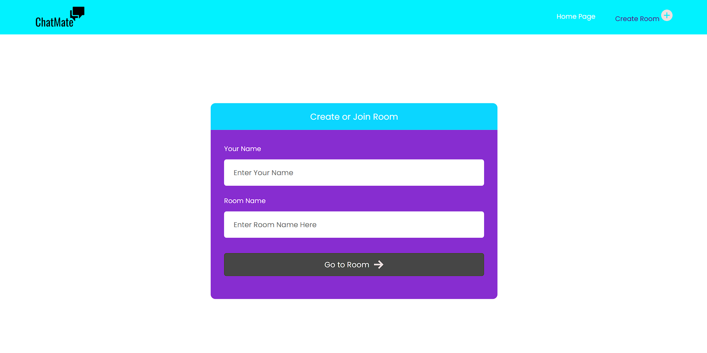
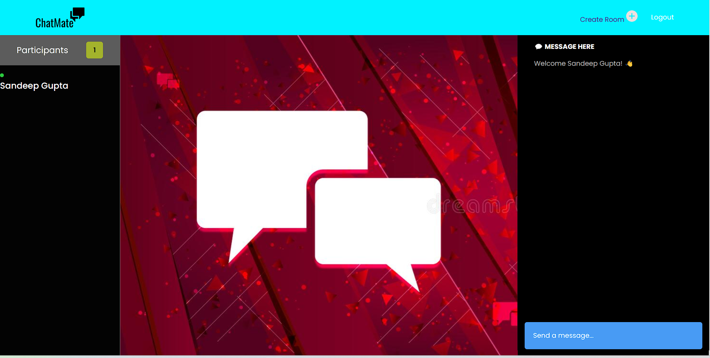
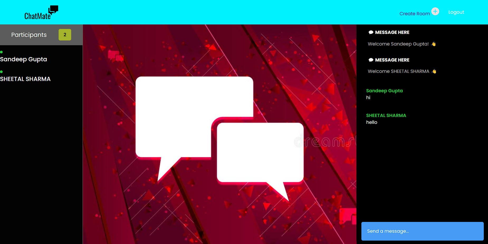

# ChatMate

#### Text-Based Chat Web-Application

## Live Links:-

ChatMate:- https://merry-starburst-7c9544.netlify.app

## Deployed Links:-

BACK-END DEPLOYED LINK -
https://jade-jealous-dhole.cyclic.app

FRONT-END DEPLOYED LINK -
https://merry-starburst-7c9544.netlify.app

## Tech Stack

Frontend:- HTML, CSS, JavaScript.

Backend:- Node.js, Express.js, Mongoose.js, Socket.io

Database:- MongoDB

## Completed a group project within a span of five days:

[SANDEEP GUPTA](https://github.com/sandeepguptax2003) (Team Lead) (Handled the Main/Room Pages - For Both Front-end and Back-end)
 
[SHEETAL SHARMA](https://github.com/SheetlSh3010) (Handled the SignUp/SignIn Pages - For Both Front-end and Back-end)

## Landing Page

## Sign-Up Page

## Sign-In Page

## Create Or Join Room Page

## Chatting Room Page

## Welcome User Page

## User Chat page

